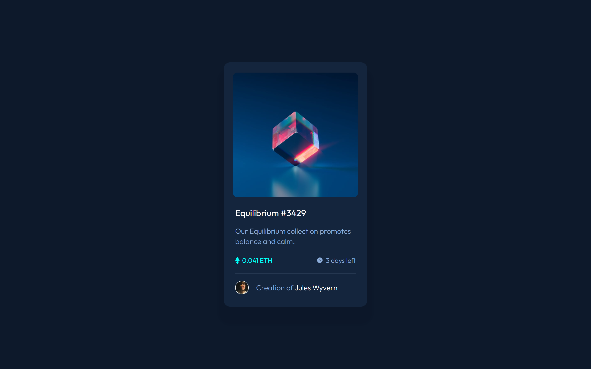

# Frontend Mentor - NFT preview card component solution

This is a solution to the [NFT preview card component challenge on Frontend Mentor](https://www.frontendmentor.io/challenges/nft-preview-card-component-SbdUL_w0U). Frontend Mentor challenges help you improve your coding skills by building realistic projects. 

## Table of contents

  - [The challenge](#the-challenge)
  - [Screenshot](#screenshot)
  - [Links](#links)
  - [Built with](#built-with)
  - [Useful resources](#useful-resources)
  - [Author](#author)

### Screenshot

### Links

- Solution URL: [solution URL here](https://github.com/ElizabethCF01/ntf-preview-card)
- Live Site URL: [live site URL here](https://elizabethcf01.github.io/ntf-preview-card/)

### Built with

- Semantic HTML5 markup
- CSS custom properties
- Flexbox
- Mobile-first workflow

### Useful resources

- [screen ruler](https://sourceforge.net/projects/screenruler/) - This helped me for measure the pixels of the elements. I really liked this pattern and will use it going forward.

## Author

- Frontend Mentor - [@ElizabethCF01](https://www.frontendmentor.io/profile/ElizabethCF01)

